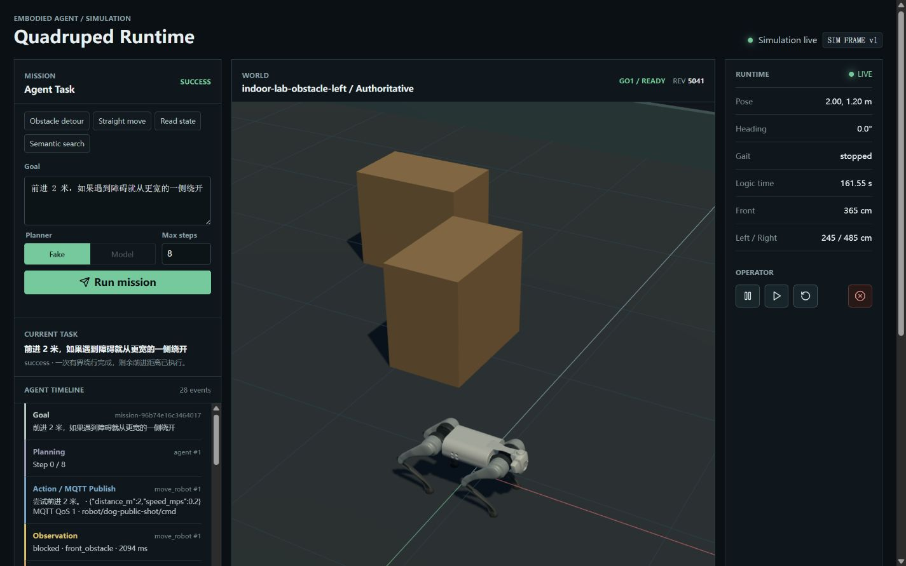
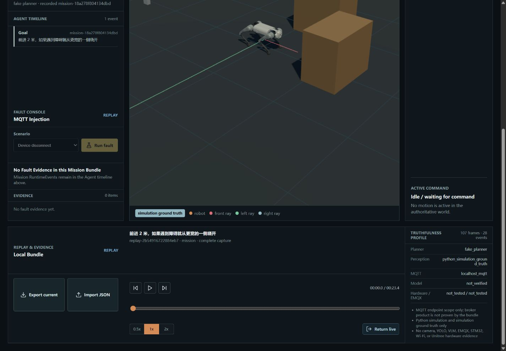
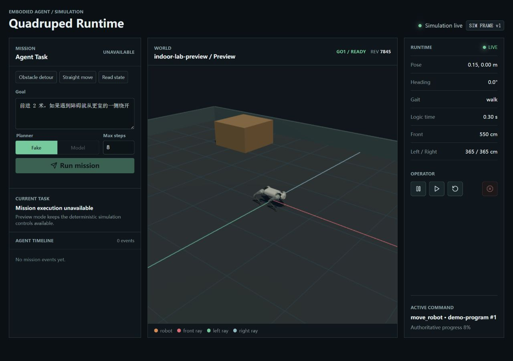
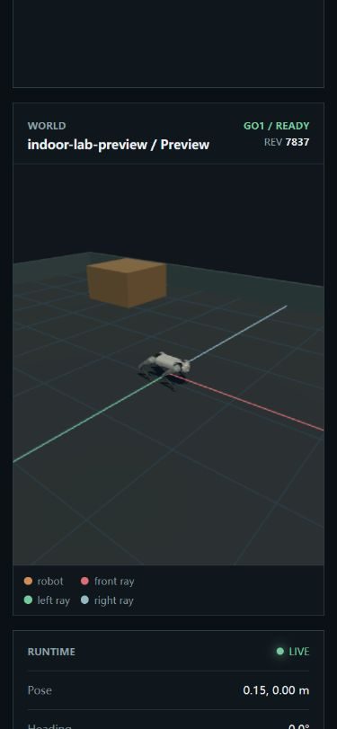

# Embodied Robot LLM Agent

### 面向具身智能任务编排、安全执行与结果验证的 Agent 仿真平台

用户输入“前进两米并绕开障碍”或“找到红色瓶子并前往蓝色目标区”等自然语言目标后，Agent 将任务拆解为受控的高层 Tool Call，经参数校验与 Safety 策略审核，再通过 MQTT 交给权威仿真环境执行。系统持续接收 Observation，根据执行结果继续任务、进行一次有界重规划或安全退出，并在浏览器中完整展示任务时间线和空间状态。

这个项目关注的不只是“让模型控制机器人”，而是如何把开放式自然语言意图转化为一条**可约束、可观察、可中止、可回放、可验证**的具身 Agent 任务闭环。


演示任务要求 Agent 找到红色瓶子并前往蓝色目标区。Agent 通过只读语义世界查询获得对象与目标信息，规划白名单 Tool Call，并在同一个任务时间线中完成执行、观察和结果确认。画面中的 Unitree GO1 模型仅用于仿真可视化；任务不包含视觉识别、抓取或搬运。

## 项目定位

具身 Agent 需要在模型的开放式决策能力与机器人运行时的确定性、安全性之间建立明确边界。直接让模型生成底层控制指令，容易带来参数越界、动作不可追踪、失败后持续尝试以及演示结果无法复核等问题。

本项目将任务链路拆成四个职责明确的部分：

| 阶段 | 产品行为 |
| --- | --- |
| 任务输入 | 用户用自然语言描述目标，不需要手工编排动作序列 |
| Agent 决策 | LangGraph Planner 只能从白名单 Tool 中选择动作并生成结构化参数 |
| 安全执行 | Safety 在 MQTT publish 前完成 Schema、距离、动作预算和运行状态校验 |
| 反馈与验证 | Python 仿真返回 Observation，Agent 有界重规划；任务可导出、回放并生成真实性报告 |

当前项目定位为可运行、可回放、可验证的具身机器人 Agent 产品原型，不是完整的 ROS、Gazebo、AirSim 或 Unitree 控制栈，也不能直接控制真实电机。公开仓库不包含 API Key；未配置模型时可使用确定性的 FakePlanner 完整体验闭环。

## 核心产品能力

- **自然语言任务编排**：将用户目标转换为结构化 Tool Call，支持直行、转向、状态读取、障碍扫描、语义查询和急停。
- **Action-Observation 闭环**：根据 `success`、`blocked`、`timeout`、`rejected` 和 `emergency_stop` 等反馈继续任务或安全退出。
- **运行时安全控制**：通过 Tool Registry、Pydantic Schema、动作预算和发布前 Safety 拒绝不合法动作。
- **实时 Mission Console**：在 Three.js 场景中同步展示机器人状态、任务步骤、Observation、故障注入和操作员控制。
- **Replay 与证据链**：导出严格 JSON Bundle，支持无副作用回放、事件顺序核验、SHA-256 manifest 和真实性报告。
- **双 Planner 模式**：FakePlanner 用于确定性演示和回归测试；OpenAI-compatible Provider 用于验证原生 Tool Calling。

## 产品能力与完成度

| 能力 | 状态 | 说明 |
| --- | --- | --- |
| LangGraph Action-Observation Loop | 可用 | 支持 FakePlanner；真实模型走 OpenAI-compatible provider |
| Tool Registry + Safety | 可用 | 模型只能看到六个高层 Tool，其中语义查询只读 |
| MQTT QoS 1 闭环 | 可用 | 本地 Mosquitto，`task_id + seq` 业务幂等 |
| Python 连续仿真 | 可用 | 固定 50 ms tick、障碍、边界、三向射线和 blocked |
| Three.js Mission Console | 可用 | 任务时间线、语义世界、Fault Console、取消、暂停/继续/重置和操作员急停 |
| GO1 级视觉模型 | 已接入 | 使用固定 commit 的 MuJoCo Menagerie Unitree GO1 STL 视觉资产；只负责渲染，不参与碰撞、传感器或任务真值 |
| Replay & Evidence | 可用 | 最近一次完成 Mission/Fault 可导出为严格 JSON，并在浏览器无副作用回放 |
| Acceptance Pack | 可用 | 固定场景生成 Bundle、SHA-256 manifest 和真实性报告 |
| OpenAI-compatible 真实调用 | 已验收（需本地配置） | 原生 Tool Calling、共享启动配置和可核验 Replay 已实现；本机显式真实场景已通过，公开仓库不包含凭据 |
| STM32/FreeRTOS 实机 | 未实现 | 当前只有 C 协议、Runtime Core 和 Cortex-M4F 静态库编译证据 |

最近一次完整本地验证结果以本页“验证”章节和发布审核清单为准。真实模型实现已覆盖原生 Tool Call 解析、最近步骤上下文、配置冻结、事件链真实性推导和显式外部调用 gate；没有本机 Provider 配置时，Acceptance 不会调用外网，也不会把 FakePlanner 冒充真实模型。

### 界面预览





### GO1 视觉证据

| 桌面 runtime | 390 px 响应式视口 |
| --- | --- |
|  |  |

## Agent 工作流与技术架构

```text
自然语言目标
  -> LangGraph Planner / FakePlanner
  -> 六个白名单 Tool + Pydantic Schema + Safety
  -> MQTT QoS 1 + task_id/seq 幂等
  -> Python Device Backend / Simulation Adapter
  -> Python 权威连续仿真世界
  -> Observation: success / blocked / timeout / rejected / emergency_stop
  -> Agent 继续、一次有界绕行或安全退出
  -> WebSocket SimulationFrame -> Three.js Mission Console
  -> Replay Bundle -> 浏览器本地只读回放 / Acceptance Pack
```

关键边界：

- LLM 只能选择高层 Tool，不能执行 Python、Shell、JavaScript 或 C 代码。
- Tool Registry 是模型可见能力的唯一白名单；Safety 拒绝发生在 MQTT publish 之前。
- Python Simulation Core 决定位姿、碰撞、传感器、blocked 和任务结果；浏览器只渲染，不回写真值。
- 当前障碍和三向距离是仿真 ground truth，不是 LiDAR、摄像头、YOLO 或 VLM 感知。
- 本地 Mosquitto RTT 只代表同一台主机上的协议样本，不能写成 Wi-Fi、STM32 或实体机器人延迟。
- Replay Mode 不 publish MQTT、不执行 AgentGraph、不推进 Engine；真实性报告不会把 FakePlanner 或本地仿真包装成真实模型或实机证据。

## 快速开始

### 前置依赖

- Python 3.12 或更高版本；
- Node.js 20.19+ 或 22.12+，npm；
- 本机 MQTT Broker。推荐 Eclipse Mosquitto，并监听 `127.0.0.1:1883`；
- 浏览器支持 WebSocket 和 WebGL。

### 安装 Python 和前端依赖

Windows PowerShell：

```powershell
python -m venv .venv
.venv\Scripts\python.exe -m pip install -e ".[dev]"
Push-Location web
npm ci
npm run build
Pop-Location
```

Linux/macOS：

```bash
python3 -m venv .venv
. .venv/bin/activate
python -m pip install -e '.[dev]'
cd web && npm ci && npm run build && cd ..
```

项目默认不启动 Broker。请先安装并启动本机 Mosquitto，再运行下面的 bridge 演示。可用 `Test-NetConnection 127.0.0.1 -Port 1883`（Windows）或 `nc -vz 127.0.0.1 1883`（Linux/macOS）确认端口。

### 启动浏览器仿真

推荐先启动 Agent + MQTT bridge 模式：

```powershell
.venv\Scripts\python.exe -m embodied_agent.cli simulation `
  --bridge --host 127.0.0.1 --port 8001 `
  --mqtt-host 127.0.0.1 --mqtt-port 1883 --device-id dog01
```

浏览器打开 <http://127.0.0.1:8001>，在任务控制台选择 Fake Planner，提交例如：

```text
前进 2 米，如果遇到障碍就从更宽的一侧绕开
```

bridge 模式会使用带前方障碍的 challenge world，演示 `blocked -> scan -> L 形绕行 -> success`。这是经过真实本地 MQTT Broker 的连续仿真闭环。

只查看确定性 preview 场景时，可运行：

```powershell
.venv\Scripts\python.exe -m embodied_agent.cli simulation `
  --host 127.0.0.1 --port 8000
```

### 运行命令行闭环

```powershell
.venv\Scripts\python.exe -m embodied_agent.cli demo `
  "前进 2 米，如果遇到障碍就从更宽的一侧绕开" `
  --broker --output reports\demo-transcript.json --max-steps 8
```

不使用 Broker 时可去掉 `--broker`，但那条路径是进程内 direct transport，不替代 MQTT 集成验收。

运行 bridge 后，也可以在另一个终端直接驱动 AgentGraph：

```powershell
.venv\Scripts\python.exe -m embodied_agent.cli simulation-demo `
  "前进 2 米，如果遇到障碍就从更宽的一侧绕开" `
  --device-id dog01 --max-steps 8 `
  --output reports\spatial-obstacle-demo.json
```

### 保存和回放任务

Mission 或 Fault Run 完成后，页面底部的 Replay & Evidence 工作台可以导出最近一次严格 Replay Bundle。导入该 JSON 后可 play/pause、seek、step 和切换 0.5x/1x/2x；Replay Mode 会禁用 Mission、Fault 与操作员 mutation 控件，退出后重新同步 live world 和 current snapshot。

固定本地验收矩阵：

```powershell
.venv\Scripts\python.exe -m embodied_agent.cli simulation-acceptance `
  --mqtt-host 127.0.0.1 --mqtt-port 1883 `
  --device-id dog-accept-local `
  --output reports\acceptance-pack-local
```

该命令生成版本化 Bundle、`manifest.json`、`truthfulness.json` 和 `truthfulness.md`。默认不会调用外部模型；即使 provider 已配置，真实模型场景也会是 `skipped: provider_opt_in_required`。未配置 provider 时是 `skipped: provider_unconfigured`。

### 可选的真实模型 provider

复制 `.env.example` 为 `.env`，填写 OpenAI-compatible 服务配置：

```text
EMBODIED_AGENT_API_KEY=<local-secret>
EMBODIED_AGENT_MODEL=<provider-model>
EMBODIED_AGENT_BASE_URL=<openai-compatible-v1-url>
```

先执行不调用模型的配置检查：

```powershell
.venv\Scripts\python.exe -m embodied_agent.cli provider-check
```

模型演示必须使用真实 Broker：

```powershell
.venv\Scripts\python.exe -m embodied_agent.cli model-demo `
  "前进 1 米" --broker --output reports\model-transcript.json
```

Bridge runtime 在启动时读取并冻结 provider 配置；修改 `.env` 后需要重启 runtime。要把真实原生 Tool Call 纳入固定 Acceptance Pack，必须明确允许外部调用：

```powershell
.venv\Scripts\python.exe -m embodied_agent.cli simulation-acceptance `
  --mqtt-host 127.0.0.1 --mqtt-port 1883 `
  --device-id dog-accept-model `
  --include-real-model `
  --output reports\acceptance-pack-model
```

只有 Replay 中存在同一 `task_id + seq + tool` 的 `tool_call → published → observation → final` 源事件顺序时，`model_transcript` 才会成为 `native_tool_calls_verified`。配置成功、Model 控件可选、普通文本 final 或正文 JSON 都不是原生 Function Calling 证据。

不要把 `.env`、API Key、provider 返回中的敏感信息或个人数据提交到 Git。

## 受控执行：六个模型可见 Tool

| Tool | 作用 |
| --- | --- |
| `move_robot` | 在安全距离和动作预算内直线移动 |
| `turn_robot` | 原地转向 |
| `get_robot_state` | 读取结构化位姿、姿态和状态 |
| `scan_obstacles` | 读取仿真世界的 front/left/right 距离 |
| `emergency_stop` | 请求设备进入急停状态 |
| `inspect_semantic_world` | 只读查询固定仿真语义对象，不移动机器人或暴露可写坐标 |

暂停、继续、重置和浏览器操作员急停是运行时控制能力，不会暴露成额外的模型 Tool。

## 验证结果与质量保障

```powershell
.venv\Scripts\python.exe -m pytest -q
.venv\Scripts\python.exe -m pip check
Push-Location web
npm test
npm run build
Pop-Location
```

2026-08-17 最新本地基线：Python `204 passed, 1 warning`，前端 `27 passed`，Vite production build 通过，主 bundle `574.18 kB`（gzip `147.66 kB`）；固件专项 `11 passed`，Keil/ArmClang 生成 245,304-byte Cortex-M4F 静态库。20 次本机 Mosquitto + Python DeviceSimulator RTT 为 P50 `0.532 ms`、P95 `0.764 ms`、max `1.237 ms`，这些数字不代表 EMQX、Wi-Fi、STM32 或电机延迟。`pip check`、`compileall`、`git diff --check` 和 `npm audit` 均通过。默认 Acceptance 仍不调用外部模型；本机显式 `--include-real-model` 验收为 `10 passed / 0 failed / 0 skipped`，真实场景的 Replay 标记为 `native_tool_calls_verified`。

固件依赖和 Keil 静态库是独立的可选证据路径：

```powershell
.venv\Scripts\python.exe scripts\firmware_deps.py fetch
.venv\Scripts\python.exe scripts\build_firmware.py --output reports\firmware-build.json
```

这只证明固定版本的 cJSON/FreeRTOS 源码可以被 ArmClang 编译成通用 Cortex-M4F 静态库；不证明 STM32 板级启动、FreeRTOS scheduler、UART/Wi-Fi、传感器、PID、PWM、舵机或电机已经联调。

## 项目结构

```text
src/embodied_agent/       Python Agent、Schema、Safety、MQTT 和仿真核心
web/src/                  Three.js 场景、Mission/Fault/Replay 控制台和严格契约解析
tests/                    Python 回归与真实 Broker 集成测试
web/tests/                前端解析和状态机测试
firmware_sim/             平台无关 C 协议参考
firmware_runtime/         UART/NDJSON/Queue/FreeRTOS 运行时适配
firmware_keil/            只生成静态库的 uVision 工程
scripts/                  固定依赖校验和固件构建入口
reports/                  精选演示截图、transcript 和验证报告
docs/                     面向贡献者、使用者和发布审核的公开文档
```

## 公开发布边界

当前仓库不包含真实机器人控制栈、板级驱动、模型权重或 API Key。GO1 视觉资产已固定放在 `web/public/assets/go1/`，来源为 [MuJoCo Menagerie 的 Unitree GO1 资产](https://github.com/google-deepmind/mujoco_menagerie/tree/da76818e269b82289eba39808e2fb91d679d6994/unitree_go1)，并随目录保留 `NOTICE.md` 与上游 BSD-3-Clause `LICENSE`。它们只在浏览器本地加载；项目不包含 MuJoCo runtime、Unitree SDK、真实电机控制，也不代表 Unitree 官方产品或背书。公开副本默认只证明本机 Mosquitto、FakePlanner 和 Python simulation ground truth；只有显式真实场景生成的 verified Bundle 才证明该次 OpenAI-compatible Tool Calling 链，Provider 品牌仍不能由 model 字符串推断。

公开范围与验证记录见 [GitHub 公开发布审核清单](docs/release/github-publication-checklist.md)。内部交接文档、`.codestable/` 工作流文件、虚拟环境、依赖 checkout、前端 `node_modules`、Keil 中间产物和 `.env` 不会进入公开仓库。

## 产品路线图

1. 继续评估真实 Provider 的响应延迟与兼容性，但不放宽 Tool Registry、Safety 或真实性证据要求；
2. 视加载性能数据决定是否拆分前端 bundle 或制作 GO1 GLB/LOD；
3. 如需实机，再单独进行 STM32 板级移植、传感器/执行器联调和真实时延测量。

## 文档

- [本地仿真使用指南](docs/user/local-simulation.md)
- [贡献者开发指南](docs/dev/contributing.md)
- [第三方依赖声明](THIRD_PARTY_NOTICES.md)
- [发布审核清单](docs/release/github-publication-checklist.md)
- [安全策略](SECURITY.md)

## 许可证

项目代码采用 [MIT License](LICENSE)，版权持有人为 `yile180304`。Unitree GO1 视觉资产保留上游独立 BSD-3-Clause 许可证与 `NOTICE.md`，不受项目 MIT 许可证替代。
